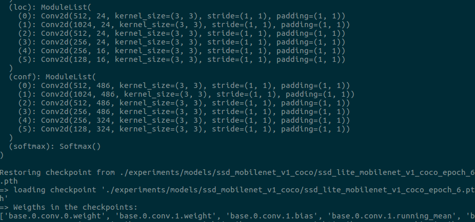
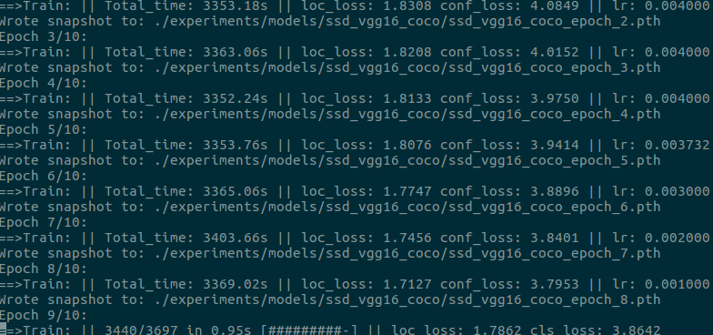
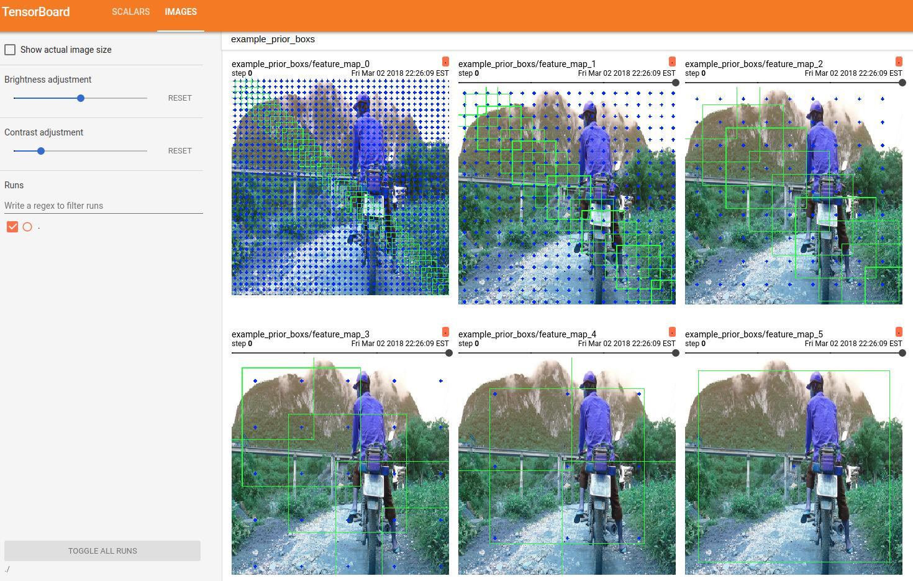
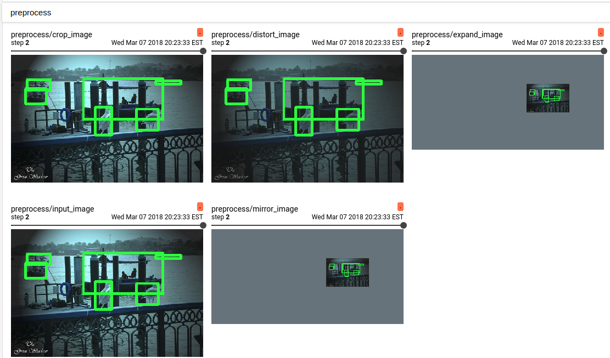
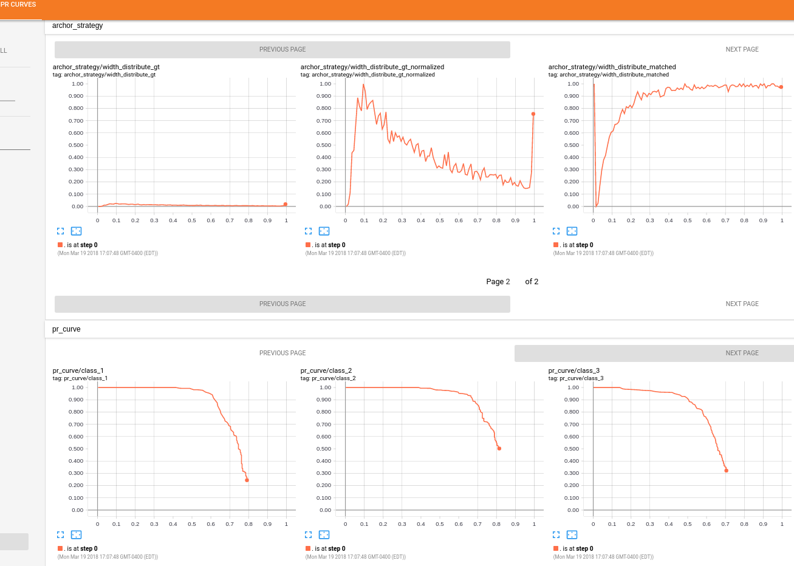
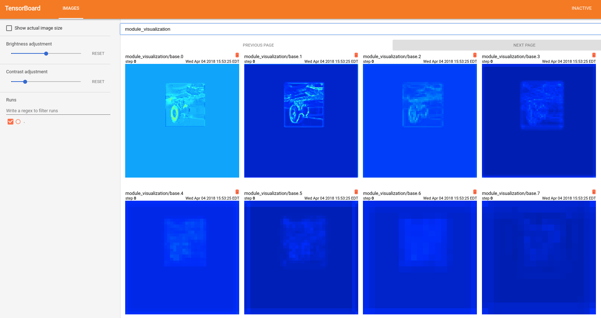

# ssds.pytorch
Repository for Single Shot MultiBox Detector and its variants, implemented with pytorch, python3.

Currently, it contains these features:
- **Multiple SSD Variants**: ssd, rfb, fssd, ssd-lite, rfb-lite, fssd-lite
- **Multiple Base Network**: VGG, Mobilenet V1/V2
- **Free Image Size**
- **Visualization** with [tensorboard-pytorch](https://github.com/lanpa/tensorboard-pytorch): training loss, eval loss/mAP, example archor boxs.

This repo is depended on the work of [ssd.pytorch](https://github.com/amdegroot/ssd.pytorch), [faster-rcnn.pytorch](https://github.com/jwyang/faster-rcnn.pytorch), [RFBNet](https://github.com/ruinmessi/RFBNet), [Detectron](https://github.com/facebookresearch/Detectron) and [Tensorflow Object Detection API](https://github.com/tensorflow/models/tree/master/research/object_detection). Thanks for there works.

### Table of Contents
- <a href='#installation'>Installation</a>
- <a href='#usage'>Usage</a>
- <a href='#performance'>Performance and Model Zoo</a>
- <a href='#visualization'>Visualization</a>
- <a href='#todo'>Future Work</a>
- <a href='#reference'>Reference</a>

## Installation
1. install [pytorch](http://pytorch.org/)
2. install requirements by `pip install -r ./requirements.txt`

## Usage
To train, test and demo some specific model. Please run the relative file in folder with the model configure file, like:

`python train.py --cfg=./experiments/cfgs/rfb_lite_mobilenetv2_train_voc.yml`

Change the configure file based on the note in [config_parse.py](./lib/utils/config_parse.py)

## Performance

| VOC2007     | YOLO_v2                                                                     | YOLO_v3                                                                     | SSD                                                                         | RFB                                                                         | FSSD                                                                        |
|-------------|-----------------------------------------------------------------------------|-----------------------------------------------------------------------------|-----------------------------------------------------------------------------|-----------------------------------------------------------------------------|-----------------------------------------------------------------------------|
| Darknet53   |                                                                             | [79.3%](https://drive.google.com/open?id=1lgPvaLr700C2dvvtroVS4zJmfxu-nfQ4) | [77.3%](https://drive.google.com/open?id=1nSoDMw_0i9O7p_Sx5cFJUVjvdcvcmDeN) | [79.5%](https://drive.google.com/open?id=16bkwgTsd8hCH84jE8AUuss7UsWChnAjS) | [81.0%](https://drive.google.com/open?id=1t0eZSVGgsgqFfdtCCNn532f9ZgOugX6p) |
| Darknet19   | [78.4%](https://drive.google.com/open?id=1QJnc6wHaVOVeNLCcm6io73_JW0wRJm2m) |                                                                             | [76.1%](https://drive.google.com/open?id=1xYv4L5U23ghQm65gfLE2V44EnZo3cZeN) | [78.4%](https://drive.google.com/open?id=15VPxxFowKUGp2B31o9HcIlsCAQ7v_JFo) | [81.0%](https://drive.google.com/open?id=1ISSFubsy2WcErxBXSeb_nxo_Dn2zpQMZ) |
| Resnet50    |                                                                             |                                                                             | [79.7%](https://drive.google.com/open?id=1qZoH0ygWhz3VLbuaAv7eQOTgNHD30kdE) | [81.2%](https://drive.google.com/open?id=1m__f2f3aA_Rj-CBjFX2RaEbQMJLejUHM) |                                                                             |
| VGG16       |                                                                             |                                                                             | [76.0%](https://drive.google.com/open?id=1TS50uVN-9_WJdyO1ImRAW0HFK11RkVlK) | [80.5%](https://drive.google.com/open?id=1bR79OsJY2cidjcI9L1DbXx2zde5sM2nf) | [77.8%](https://drive.google.com/open?id=1HPotrN0oM0oUQu_o-i_VYRYFlT3PKDrr) |
| MobilenetV1 | [74.7%](https://drive.google.com/open?id=1hTSphBtcszTBU_yGd1GCej-nfqM3vWcn) | [78.2%](https://drive.google.com/open?id=19dTKYxPwDjdo9bqnIqhx_IcqK-IAln5J) | [72.7%](https://drive.google.com/open?id=1NMxw-bhvHTGThyNl-MKJrsou4n7HyDCG) | [73.7%](https://drive.google.com/open?id=1DWleN7Rcf92QYVAoeSxUeK7COXD4cuPN) | [78.4%](https://drive.google.com/open?id=1BVF7OaFcffJkqXbYBj1pj1nvX7ku8a55) |
| MobilenetV2 | [72.0%](https://drive.google.com/open?id=1cBy3ISmwfnM0ziRD-sEM5ARcgp3ANvQj) | [75.8%](https://drive.google.com/open?id=1xqo6PHn6V3YBkYAKgL7v6a_aqBoRqa2i) | [73.2%](https://drive.google.com/open?id=1SBeSIFv5z9AUtwcrJgPI4Xpc8-BCN6ro) | [73.4%](https://drive.google.com/open?id=1KUh1uvCJS_qEgq1r3t0VEYVge8K8tEzR) | [76.7%](https://drive.google.com/open?id=1t7kxurvfbXNYbFR64EULFSabWQpT256n) |

| COCO2017    | YOLO_v2                                                                     | YOLO_v3                                                                     | SSD                                                                         | RFB                                                                         | FSSD                                                                        |
|-------------|-----------------------------------------------------------------------------|-----------------------------------------------------------------------------|-----------------------------------------------------------------------------|-----------------------------------------------------------------------------|-----------------------------------------------------------------------------|
| Darknet53   |                                                                             | [27.3%](https://drive.google.com/open?id=1Y07Emhi-a7WiwPwHqym6KrZ3VXJtbpw9) | [21.1%](https://drive.google.com/open?id=1cPBdXbdxAzRuKvNSZ-3h27Z76BCD99w4) | [22.8%](https://drive.google.com/open?id=1776kdPiiWa5ND3xwemjdplds0PjscGDc) | [25.8%](https://drive.google.com/open?id=1iR8J5Eg5OEom5cyAtFXVPj6iBnC9JyGt) |
| Darknet19   | [21.6%](https://drive.google.com/open?id=1Os3__ks3BcBZBSbVRKF8e6BvBMEWn9hy) |                                                                             | [20.6%](https://drive.google.com/open?id=1FdgchkCAzB9VwR-HdZ4Gh3TG8Acrg_M8) | [22.4%](https://drive.google.com/open?id=1s7vS0Q0Djlq8q2iGXY3UzuFTPZ0PQNfY) | [26.4%](https://drive.google.com/open?id=1i6Zx3J71jcM8xP3GDDbTYxJwWUpYH0jb) |
| Resnet50    |                                                                             |                                                                             | [25.1%](https://drive.google.com/open?id=1Ahj27wzDWSMCTlpcO_eyEXO0zRQSmPn8) | [26.5%](https://drive.google.com/open?id=1X-OkVZHDS1w6pe2mPgJPYPm2_-ZG0_KB) | [27.2%](https://drive.google.com/open?id=12EsRdIZtTM3Wh8UI3VLXQAq6-24SZRpj) |
| VGG16       |                                                                             |                                                                             | [25.4%](https://drive.google.com/open?id=1Bkt_nZW4fe_UrLyPOVltq0C7cTpABlQI) | [25.5%](https://drive.google.com/open?id=1j5G0dDuvofGh5POUPk0s9ys8by0wEDFL) | [27.2%](https://drive.google.com/open?id=1qf5ccFDp2TVP-7xUggrabfWwwYt5BTrG) |
| MobilenetV1 | [21.5%](https://drive.google.com/open?id=1ZdiWfBvqBI8ICPP9p4UsQCgY5pSBJxTa) | [25.7%](https://drive.google.com/open?id=1j7Co11dfT_OJIwAqNpTgjIA-I-btlOXc) | [18.8%](https://drive.google.com/open?id=1yBpd3aIDvlK2j7HxsNj8kJuASTCaN5Bo) | [19.1%](https://drive.google.com/open?id=1SexO9XZFpMK2JGmr0mTGqosud-tb2wNe) | [24.2%](https://drive.google.com/open?id=1jRDwuXIeST4F5UBY2Z379nvkxz_OtxVd) |
| MobilenetV2 | [20.4%](https://drive.google.com/open?id=1mr1KhqW2FkkBNKGeoaWlB_D0dDLwL05L) | [24.0%](https://drive.google.com/open?id=1-jV9TtRdwrwUrvtmx1z8BLJRGv_lmF-6) | [18.5%](https://drive.google.com/open?id=1FXjPnJ3X7PdH7Ii6lOEFA8EkKif4Ppnn) | [18.5%](https://drive.google.com/open?id=1uRfoi6iJo8Vd5yYMhzFJ97_l3NLtQhf-) | [22.2%](https://drive.google.com/open?id=1lOOjp4ZG1tkggSIbilT5ajKUJ-a-GRMK) |

| Net InferTime* (fp32) | YOLO_v2 | YOLO_v3 | SSD    | RFB    | FSSD   |
|-----------------------|---------|---------|--------|--------|--------|
| Darknet53             |         | 5.11ms  | 4.32ms | 6.63ms | 4.41ms |
| Darknet19             | 1.64ms  |         | 2.21ms | 4.57ms | 2.29ms |
| Resnet50              |         |         | 3.60ms | 6.04ms | 3.85ms |
| VGG16                 |         |         | 1.75ms | 4.20ms | 1.98ms |
| MobilenetV1           | 2.02ms  | 3.31ms  | 2.80ms | 3.84ms | 2.62ms |
| MobilenetV2           | 3.35ms  | 4.69ms  | 4.05ms | 5.26ms | 4.00ms |

(*-only calculate the all network inference time, without pre-processing & post-processing. 
In fact, the speed of vgg is super impress me. Maybe it is caused by MobilenetV1 and MobilenetV2 is using -lite structure, which uses the seperate conv in the base and extra layers.)

## Visualization

- visualize the network graph (terminal) -tensorboard has bugs.

- visualize the loss during the training progress and meanAP during the eval progress (terminal & tensorboard)

- visualize archor box for each feature extractor (tensorboard)

- visualize the preprocess steps for training (tensorboard)

- visualize the pr curve for different classes and anchor matching strategy for different properties during evaluation (tensorboard)

(*guess the dataset in the figure, coco or voc?)

- visualize featuremap and grads (not satisfy me, does not give me any information. any suggestions? )

## TODO
- prepare update to pytorch 0.4.0
- add DSSDs: DSSD FPN TDM
- test the multi-resolution traning
- add rotation for prerprocess
- test focal loss
- add resnet, xception, inception
- figure out the problem of visualize graph
- speed up preprocess part (any suggestion?)
- speed up postprocess part (any suggestion?) huge bug!!!
<!-- - add half precision based on [csarofeen/examples](https://github.com/csarofeen/examples/tree/dist_fp16) -->
- add network visualization based on [pytorch-cnn-visualizations](https://github.com/utkuozbulak/pytorch-cnn-visualizations)
- [object detection](https://github.com/handong1587/handong1587.github.io/blob/master/_posts/deep_learning/2015-10-09-object-detection.md)
<!-- - convert to tensorrt based on [this](https://docs.nvidia.com/deeplearning/sdk/tensorrt-api/topics/topics/workflows/manually_construct_tensorrt_engine.html) -->

## Reference
